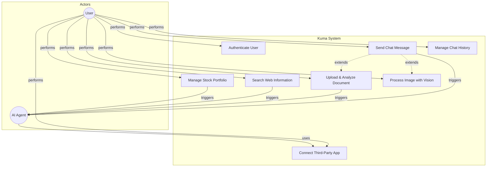
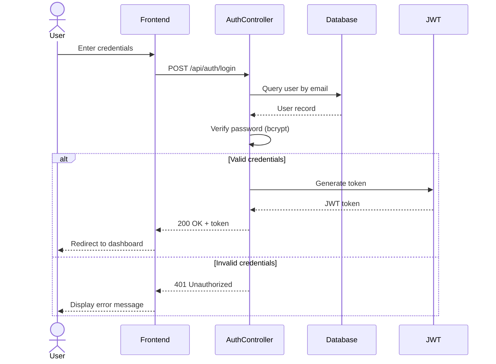
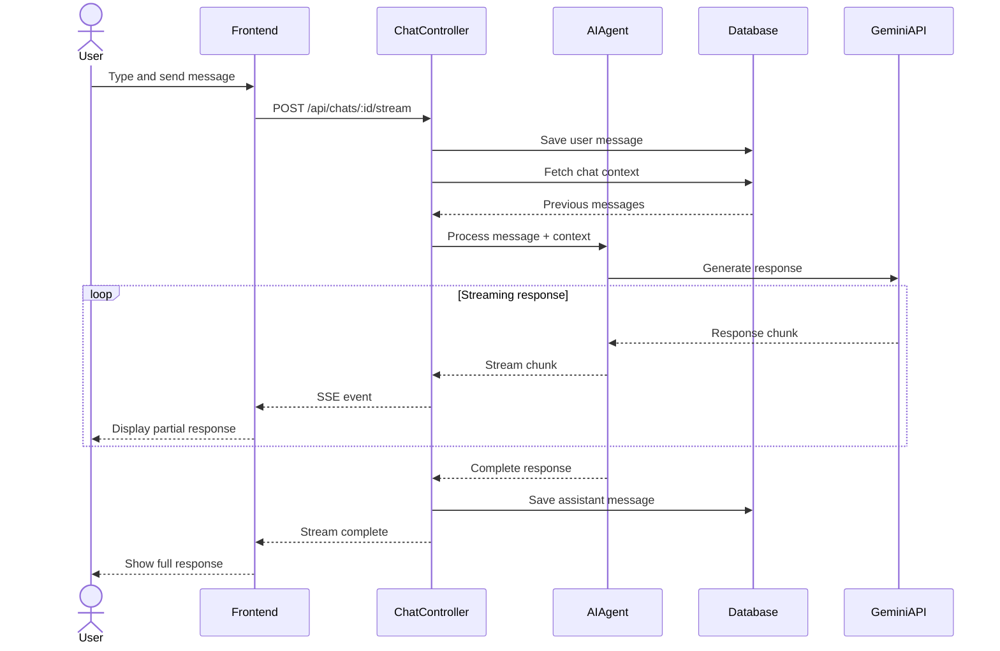
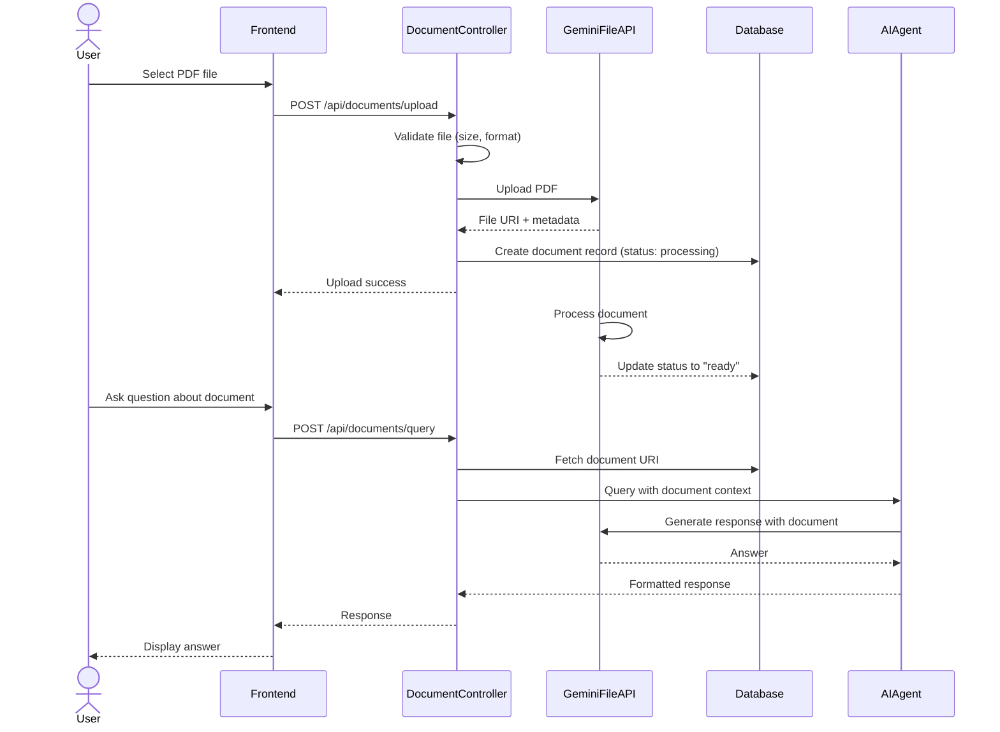
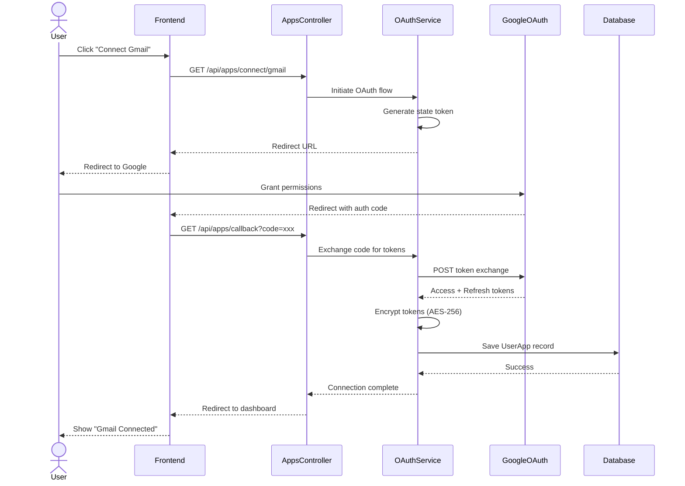

# Software Requirements Specification (SRS) Report
## Kuma - AI-Powered Personal Assistant

---

## 1. Software Requirements Specification

### 1.1 Project Overview

**Kuma** is an intelligent AI-powered personal assistant application that leverages Google Gemini and LangChain to provide specialized assistance across multiple domains. The system features a full-stack architecture with a TypeScript backend (Bun + Express + Prisma) and a React frontend (Vite + TypeScript), offering multimodal chat capabilities, document processing, and seamless integration with third-party applications.

### 1.2 Functional Requirements

#### FR1: User Authentication & Authorization
- **FR1.1**: System shall support user registration with email and password
- **FR1.2**: System shall authenticate users using JWT tokens
- **FR1.3**: System shall hash passwords using bcrypt (minimum 10 salt rounds)
- **FR1.4**: System shall maintain user sessions across multiple devices

#### FR2: Multi-Agent Chat System
- **FR2.1**: System shall provide multiple specialized AI agents (Router, Research, Financial, Stock Market)
- **FR2.2**: System shall support real-time streaming chat responses using Server-Sent Events (SSE)
- **FR2.3**: System shall maintain conversation history with persistent storage
- **FR2.4**: System shall support multimodal input (text, images, documents)
- **FR2.5**: System shall allow users to switch between agents during conversations

#### FR3: Document Processing & RAG
- **FR3.1**: System shall accept PDF uploads up to 50MB
- **FR3.2**: System shall process documents using Gemini File API
- **FR3.3**: System shall support document querying, summarization, text extraction, and comparison
- **FR3.4**: System shall maintain document status tracking (processing/ready/failed)
- **FR3.5**: System shall automatically clean up expired documents (48-hour retention)

#### FR4: Vision & Image Processing
- **FR4.1**: System shall accept image uploads (JPEG, PNG, GIF, WebP) up to 10MB
- **FR4.2**: System shall analyze images using Gemini Vision API
- **FR4.3**: System shall support OCR (text extraction from images)
- **FR4.4**: System shall maintain image history within chat conversations

#### FR5: Third-Party App Integrations
- **FR5.1**: System shall integrate with Gmail (send, read, search emails)
- **FR5.2**: System shall integrate with Google Calendar (create, list, update events)
- **FR5.3**: System shall integrate with Google Docs (create, read, update documents)
- **FR5.4**: System shall integrate with Google Drive (file management)
- **FR5.5**: System shall integrate with Google Sheets (spreadsheet operations)
- **FR5.6**: System shall integrate with Google Slides (presentation creation)
- **FR5.7**: System shall integrate with GitHub (repository and issue management)
- **FR5.8**: System shall use OAuth 2.0 for secure app connections
- **FR5.9**: System shall encrypt stored OAuth tokens using AES-256

#### FR6: Web Search & Information Retrieval
- **FR6.1**: System shall perform semantic web search using Exa API
- **FR6.2**: System shall extract content from web pages
- **FR6.3**: System shall find similar web pages

#### FR7: Stock Market Tools
- **FR7.1**: System shall retrieve real-time stock prices
- **FR7.2**: System shall provide company information
- **FR7.3**: System shall fetch financial news
- **FR7.4**: System shall display historical stock data

#### FR8: Memory & Context Management
- **FR8.1**: System shall maintain thread-based conversation memory
- **FR8.2**: System shall summarize older messages to optimize token usage
- **FR8.3**: System shall support semantic search across conversation history
- **FR8.4**: System shall integrate with Supermemory for long-term context

### 1.3 Non-Functional Requirements

#### NFR1: Performance
- **NFR1.1**: System shall respond to chat messages within 3 seconds (excluding AI processing time)
- **NFR1.2**: System shall support streaming responses with time-to-first-byte under 1 second
- **NFR1.3**: System shall handle concurrent users with connection pooling
- **NFR1.4**: System shall optimize database queries using Prisma caching

#### NFR2: Security
- **NFR2.1**: System shall protect all API endpoints with JWT authentication
- **NFR2.2**: System shall prevent SQL injection using Prisma ORM
- **NFR2.3**: System shall implement CORS with whitelist-based origin validation
- **NFR2.4**: System shall encrypt sensitive credentials (OAuth tokens, API keys)
- **NFR2.5**: System shall validate all user inputs using Zod schemas

#### NFR3: Scalability
- **NFR3.1**: System shall support horizontal scaling for backend services
- **NFR3.2**: System shall use asynchronous operations for non-blocking I/O
- **NFR3.3**: System shall implement efficient database indexing

#### NFR4: Usability
- **NFR4.1**: System shall provide a responsive UI for mobile and desktop
- **NFR4.2**: System shall support markdown rendering in chat messages
- **NFR4.3**: System shall display toast notifications for user feedback
- **NFR4.4**: System shall show loading states during processing

#### NFR5: Reliability
- **NFR5.1**: System shall handle errors gracefully with user-friendly messages
- **NFR5.2**: System shall maintain 99.5% uptime for production environments
- **NFR5.3**: System shall implement automatic retry mechanisms for failed API calls

#### NFR6: Maintainability
- **NFR6.1**: System shall follow TypeScript strict mode for type safety
- **NFR6.2**: System shall maintain comprehensive API documentation
- **NFR6.3**: System shall use version-controlled database migrations

### 1.4 System Constraints

- **SC1**: System requires PostgreSQL database (version 12+)
- **SC2**: System requires Bun runtime (version 1.0+)
- **SC3**: System requires Google Gemini API access
- **SC4**: System limited by Gemini File API 48-hour document retention
- **SC5**: System limited by third-party API rate limits (Exa, Yahoo Finance, Google APIs)
- **SC6**: Image uploads limited to 10MB per file
- **SC7**: PDF uploads limited to 50MB per file
- **SC8**: System requires HTTPS in production for OAuth flows

---

## 2. Use Case Diagram

---

## 3. Use Case Explanations

### UC1: Authenticate User

**Description**: User registers or logs into the Kuma system to access personalized AI assistant features.

**Actors**: User

**Preconditions**: 
- System is accessible via web interface
- Database is operational

**Postconditions**: 
- User receives JWT authentication token
- User session is established
- User can access protected features

**Main Flow**:
1. User navigates to login/register page
2. User enters email and password
3. System validates credentials
4. System generates JWT token
5. System returns token to user
6. User is redirected to dashboard

**Alternative Flows**:
- **A1**: Invalid credentials → System displays error message
- **A2**: New user registration → System creates user account with hashed password
- **A3**: Token expiration → System prompts re-authentication

---

### UC2: Send Chat Message

**Description**: User interacts with AI agents through natural language conversation, receiving intelligent responses.

**Actors**: User, AI Agent

**Preconditions**:
- User is authenticated
- At least one AI agent is available
- Chat session exists or can be created

**Postconditions**:
- Message is stored in database
- AI response is generated and displayed
- Conversation context is updated

**Main Flow**:
1. User selects or creates a chat
2. User types message in chat interface
3. System sends message to backend
4. System identifies appropriate AI agent
5. AI Agent processes message with context
6. System streams response to user
7. System saves message and response to database

**Alternative Flows**:
- **A1**: User uploads image → System includes image in multimodal processing
- **A2**: User attaches document → System processes document with RAG
- **A3**: AI requires tool → System executes tool and incorporates result
- **A4**: Network error → System displays retry option

---

### UC3: Upload & Analyze Document

**Description**: User uploads PDF documents for AI-powered analysis, querying, summarization, and comparison.

**Actors**: User, AI Agent

**Preconditions**:
- User is authenticated
- Document size is under 50MB
- Document is in PDF format

**Postconditions**:
- Document is uploaded to Gemini File API
- Document metadata is stored in database
- Document is available for querying

**Main Flow**:
1. User clicks upload document button
2. User selects PDF file from device
3. System validates file size and format
4. System uploads file to Gemini File API
5. System creates document record with "processing" status
6. Gemini processes document
7. System updates status to "ready"
8. User can query, summarize, or compare document

**Alternative Flows**:
- **A1**: File too large → System displays error
- **A2**: Processing fails → System marks status as "failed"
- **A3**: Document expires (48 hours) → System automatically removes record
- **A4**: Multi-document comparison → System processes multiple PDFs together

---

### UC4: Connect Third-Party App

**Description**: User connects external applications (Gmail, Calendar, Drive, GitHub, etc.) to enable AI agent integrations.

**Actors**: User

**Preconditions**:
- User is authenticated
- Third-party app supports OAuth 2.0
- App configuration exists in system

**Postconditions**:
- OAuth tokens are encrypted and stored
- App is marked as "connected" for user
- AI agents can use app-specific tools

**Main Flow**:
1. User navigates to app integrations page
2. User clicks "Connect" on desired app
3. System initiates OAuth 2.0 flow
4. User is redirected to app authorization page
5. User grants permissions
6. App redirects back with authorization code
7. System exchanges code for access/refresh tokens
8. System encrypts and stores tokens
9. System marks app as connected

**Alternative Flows**:
- **A1**: User denies permissions → Connection fails, user notified
- **A2**: Token refresh needed → System automatically refreshes using refresh token
- **A3**: User disconnects app → System revokes tokens and removes connection
- **A4**: OAuth error → System displays error and retry option

---

### UC5: Search Web Information

**Description**: User requests web search through AI agent, which performs semantic search and retrieves relevant information.

**Actors**: User, AI Agent

**Preconditions**:
- User is authenticated
- Exa API key is configured
- User has active chat session

**Postconditions**:
- Search results are retrieved
- Information is synthesized by AI
- Results are displayed in chat

**Main Flow**:
1. User asks question requiring web search
2. AI Agent identifies need for web search tool
3. System calls Exa API with search query
4. Exa returns relevant web results
5. AI Agent analyzes and synthesizes information
6. System displays formatted response to user

**Alternative Flows**:
- **A1**: No results found → AI informs user and suggests alternative queries
- **A2**: API rate limit → System notifies user to retry later
- **A3**: User requests specific page content → System extracts full page content

---

### UC6: Manage Stock Portfolio

**Description**: User queries stock information, prices, and financial news through the Stock Market Agent.

**Actors**: User, AI Agent (Stock Market)

**Preconditions**:
- User is authenticated
- Yahoo Finance API is accessible
- User has active chat with Stock Market Agent

**Postconditions**:
- Stock data is retrieved and displayed
- Financial insights are provided
- Information is stored in chat history

**Main Flow**:
1. User asks about specific stock or company
2. Stock Market Agent identifies required data
3. System calls Yahoo Finance API
4. System retrieves stock price, company info, or news
5. AI Agent analyzes data and provides insights
6. System displays formatted response with data

**Alternative Flows**:
- **A1**: Invalid stock symbol → AI requests clarification
- **A2**: Market closed → AI provides last available data with timestamp
- **A3**: Historical data request → System retrieves time-series data

---

### UC7: Process Image with Vision

**Description**: User uploads images for AI-powered analysis, OCR, and visual question answering.

**Actors**: User, AI Agent

**Preconditions**:
- User is authenticated
- Image format is supported (JPEG, PNG, GIF, WebP)
- Image size is under 10MB

**Postconditions**:
- Image is stored in chat-specific directory
- Image is analyzed by Gemini Vision
- Analysis results are displayed

**Main Flow**:
1. User clicks image upload button in chat
2. User selects image(s) from device (up to 5)
3. System validates format and size
4. System saves images to storage
5. User sends message with images
6. System sends images to Gemini Vision API
7. AI analyzes images and generates response
8. System displays response with image previews

**Alternative Flows**:
- **A1**: Image too large → System displays error
- **A2**: OCR request → AI extracts text from image
- **A3**: Follow-up question → AI maintains image context
- **A4**: Multiple images → AI analyzes all images together

---

### UC8: Manage Chat History

**Description**: User creates, views, updates, and deletes chat conversations with AI agents.

**Actors**: User

**Preconditions**:
- User is authenticated

**Postconditions**:
- Chat operations are reflected in database
- UI is updated accordingly

**Main Flow**:
1. User navigates to chat interface
2. User views list of existing chats
3. User selects action (create, view, rename, delete)
4. System processes request
5. System updates database
6. System refreshes UI

**Alternative Flows**:
- **A1**: Create new chat → System generates unique thread ID
- **A2**: Rename chat → System updates chat title
- **A3**: Delete chat → System removes chat and all messages
- **A4**: View messages → System loads paginated message history

---

## 4. Analysis Classes (Noun Phrase Approach)

Based on the SRS, the following analysis classes have been identified:

### Class 1: User
**Responsibilities**:
- Store user authentication credentials
- Manage user profile information
- Track user's chats, connected apps, and uploaded documents

**Attributes**:
- `id`: String (UUID)
- `email`: String (unique)
- `password`: String (hashed)
- `createdAt`: DateTime
- `updatedAt`: DateTime

**Relationships**:
- Has many Chats
- Has many UserApps
- Has many Documents

---

### Class 2: Chat
**Responsibilities**:
- Represent a conversation thread
- Store agent type and thread ID
- Maintain relationship with messages

**Attributes**:
- `id`: String (UUID)
- `userId`: String (foreign key)
- `title`: String
- `agentType`: String (router, research, financial, stock-market)
- `threadId`: String (unique)
- `createdAt`: DateTime
- `updatedAt`: DateTime

**Relationships**:
- Belongs to User
- Has many Messages
- Has many Documents (optional)

---

### Class 3: Message
**Responsibilities**:
- Store individual chat messages
- Track message role (user, assistant, tool, system)
- Store tool calls and results
- Maintain image and document attachments

**Attributes**:
- `id`: String (UUID)
- `chatId`: String (foreign key)
- `role`: String (user, assistant, tool, system)
- `content`: String
- `toolCalls`: JSON (optional)
- `images`: String[] (file paths)
- `documentIds`: String[] (references)
- `createdAt`: DateTime

**Relationships**:
- Belongs to Chat
- References Documents (many-to-many)

---

### Class 4: Agent
**Responsibilities**:
- Define AI agent configurations
- Store system prompts and capabilities
- Manage agent availability

**Attributes**:
- `id`: String (UUID)
- `name`: String (unique)
- `displayName`: String
- `description`: String
- `systemPrompt`: String
- `isActive`: Boolean
- `createdAt`: DateTime

**Relationships**:
- Referenced by Chats (via agentType)

---

### Class 5: UserApp
**Responsibilities**:
- Manage user connections to third-party apps
- Store encrypted OAuth tokens
- Track connection status

**Attributes**:
- `id`: String (UUID)
- `userId`: String (foreign key)
- `appName`: String (gmail, calendar, docs, drive, sheets, slides, github)
- `encryptedTokens`: JSON (access token, refresh token)
- `isConnected`: Boolean
- `metadata`: JSON (user info, scopes)
- `createdAt`: DateTime
- `updatedAt`: DateTime

**Relationships**:
- Belongs to User
- References App configuration

---

### Class 6: Document
**Responsibilities**:
- Track uploaded PDF documents
- Store Gemini File API references
- Manage document processing status

**Attributes**:
- `id`: String (UUID)
- `userId`: String (foreign key)
- `chatId`: String (optional foreign key)
- `filename`: String
- `fileUri`: String (Gemini File API URI)
- `mimeType`: String
- `sizeBytes`: Integer
- `status`: String (processing, ready, failed)
- `summary`: String (optional)
- `expiresAt`: DateTime
- `createdAt`: DateTime

**Relationships**:
- Belongs to User
- Optionally belongs to Chat
- Referenced by Messages

---

## 5. Sequence and Interaction Diagrams

### Diagram 1: User Authentication Sequence

---

### Diagram 2: Chat Message with AI Agent Processing

---

### Diagram 3: Document Upload and RAG Processing

---

### Diagram 4: Third-Party App OAuth Connection

---

## 6. Summary

This Software Requirements Specification document provides a comprehensive overview of the **Kuma AI-Powered Personal Assistant** system. The document covers:

1. **Functional and Non-Functional Requirements**: Detailed specifications for authentication, multi-agent chat, document processing, vision capabilities, third-party integrations, and system quality attributes.

2. **Use Case Analysis**: Eight primary use cases with detailed flows, preconditions, and postconditions covering all major system functionalities.

3. **Analysis Classes**: Six core domain classes identified using noun phrase approach from the SRS, including User, Chat, Message, Agent, UserApp, and Document.

4. **Sequence Diagrams**: Four detailed interaction diagrams illustrating authentication, chat processing, document RAG, and OAuth integration flows.

The system architecture follows modern best practices with TypeScript for type safety, Prisma for database management, and a microservices-oriented approach for AI agent orchestration. The use of streaming responses, multimodal processing, and secure OAuth integrations positions Kuma as a comprehensive AI assistant platform.

---

**Document Version**: 1.0  
**Date**: December 11, 2025  
**Project**: Kuma - AI-Powered Personal Assistant
