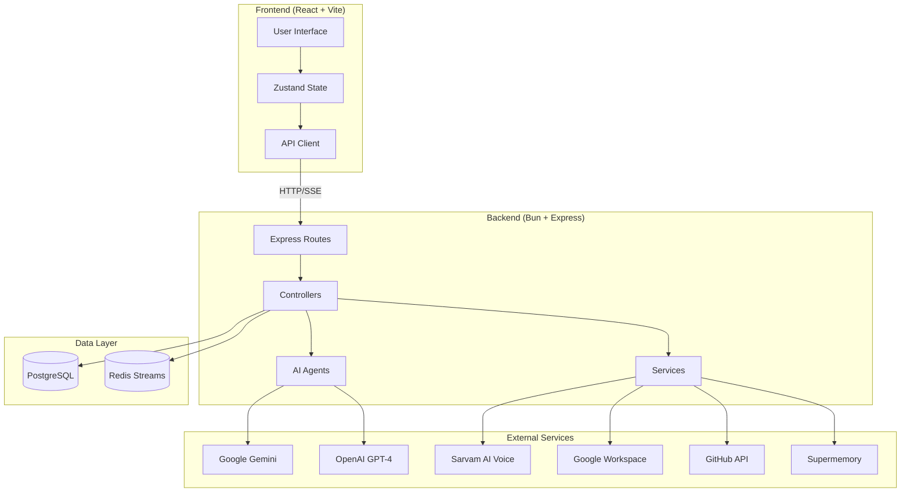
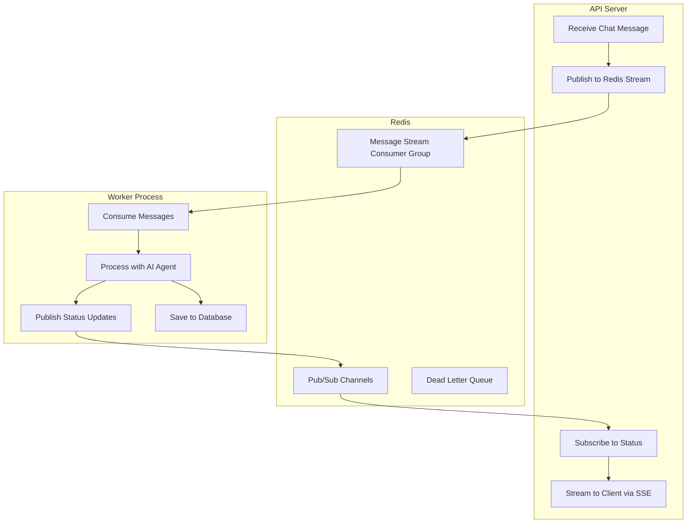
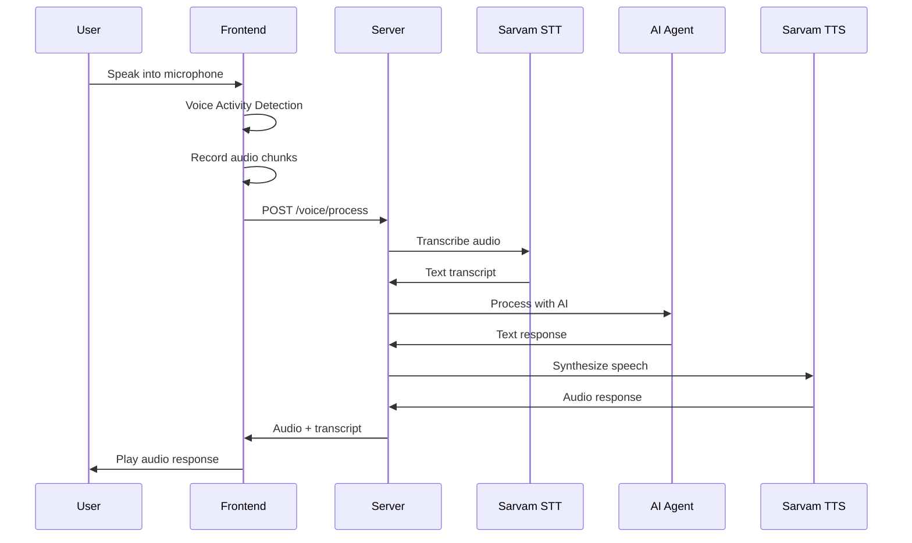
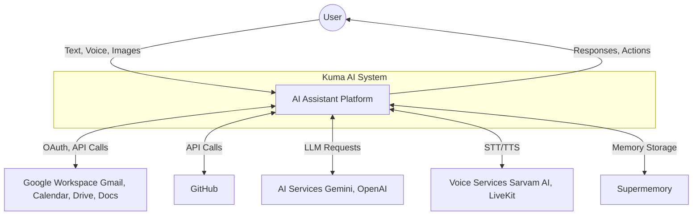
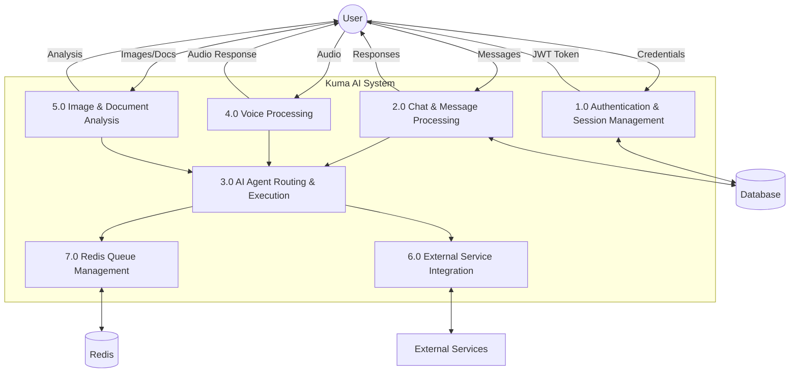
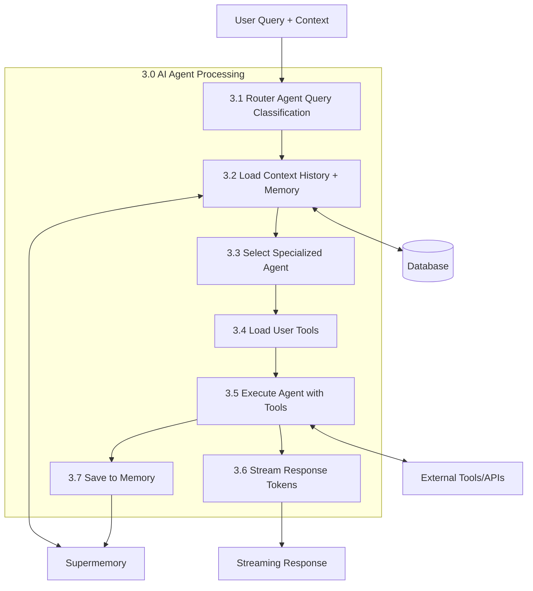
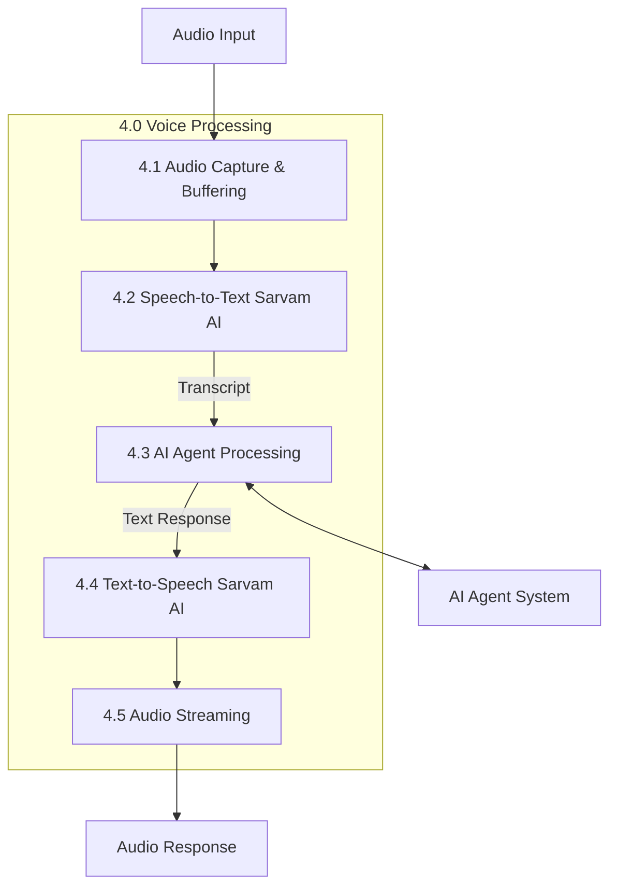
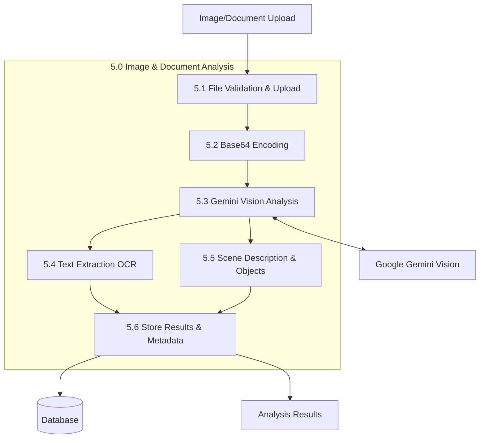

# Kuma AI - Architecture Documentation (Report Diagrams Only)

This document contains only the essential diagrams needed for the mini project report.

## Diagrams Included

1. System Architecture
2. Redis Queue Architecture  
3. Voice Processing Flow
4. Level 0 DFD (Context Diagram)
5. Level 1 DFD
6. Level 2 DFD - Agent Processing
7. Level 2 DFD - Voice Processing
8. Level 2 DFD - Image Processing

---

## 1. System Architecture

**Figure: System Architecture of Kuma AI Assistant**

---

## 2. Redis Queue Architecture

**Figure: Redis Message Queue Architecture**

---

## 3. Voice Processing Flow

**Figure: Voice Processing Pipeline**

---

## 4. Level 0 DFD - Context Diagram

**Figure: Context Diagram (Level 0 DFD)**

---

## 5. Level 1 DFD

**Figure: Level 1 Data Flow Diagram**

---

## 6. Level 2 DFD - Agent Processing

**Figure: Level 2 DFD - Agent Processing Module**

---

## 7. Level 2 DFD - Voice Processing

**Figure: Level 2 DFD - Voice Processing Module**

---

## 8. Level 2 DFD - Image Processing

**Figure: Level 2 DFD - Image Processing Module**

---

## How to Use These Diagrams

1. Copy each mermaid code block
2. Paste into Mermaid Live Editor: https://mermaid.live
3. Export as PNG or SVG
4. Save with appropriate filename
5. Place in report images directory
6. Update LaTeX `\includegraphics` commands

## Recommended Filenames

- `system_architecture.png`
- `redis_architecture.png`
- `voice_pipeline.png`
- `dfd_level0.png`
- `dfd_level1.png`
- `dfd_agent_processing.png`
- `dfd_voice_processing.png`
- `dfd_image_processing.png`
