# Kuma AI - Architecture Documentation

## Table of Contents

1. [System Overview](#system-overview)
2. [High-Level Architecture](#high-level-architecture)
3. [Component Architecture](#component-architecture)
4. [Data Flow Diagrams](#data-flow-diagrams)
5. [Authentication Flow](#authentication-flow)
6. [Chat Message Flow](#chat-message-flow)
7. [AI Agent Architecture](#ai-agent-architecture)
8. [Tool Execution Flow](#tool-execution-flow)
9. [OAuth Integration Flow](#oauth-integration-flow)
10. [Document Processing (RAG) Flow](#document-processing-rag-flow)
11. [Memory System Architecture](#memory-system-architecture)
12. [Voice Processing Flow](#voice-processing-flow)
13. [Redis Queue Architecture](#redis-queue-architecture)
14. [Database Schema Diagram](#database-schema-diagram)
15. [Deployment Architecture](#deployment-architecture)
16. [Security Architecture](#security-architecture)

---

## System Overview

Kuma AI is a full-stack AI assistant application with the following core capabilities:

- **Conversational AI** with multi-agent support
- **Tool calling** for external service integrations
- **Document analysis** with RAG (Retrieval Augmented Generation)
- **Long-term memory** for personalized conversations
- **Voice interface** with speech-to-text and text-to-speech
- **OAuth integrations** with Google Workspace and GitHub

---

## High-Level Architecture

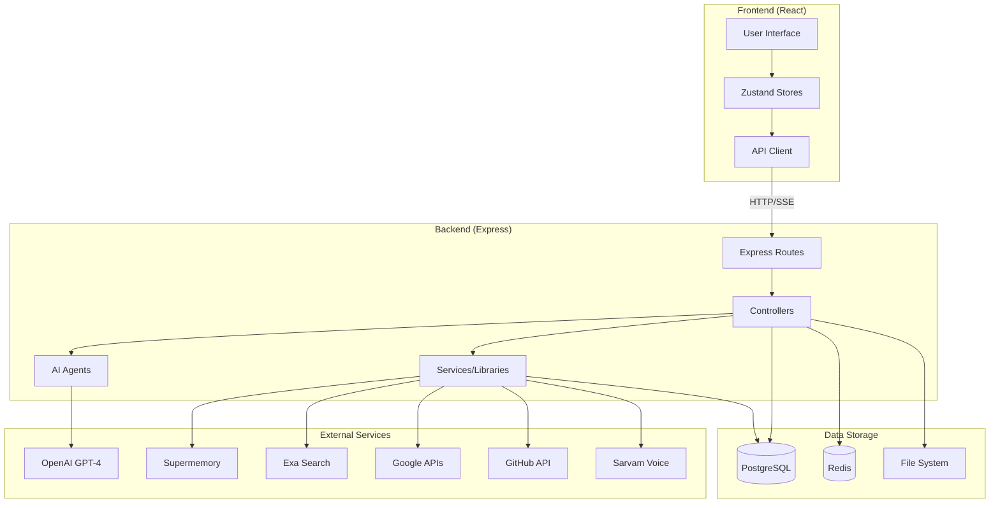
```mermaid
flowchart TB
    subgraph Client["Frontend (React)"]
        UI[User Interface]
        Store[Zustand Stores]
        API[API Client]
    end

    subgraph Server["Backend (Express)"]
        Routes[Express Routes]
        Controllers[Controllers]
        Services[Services/Libraries]
        Agents[AI Agents]
    end

    subgraph External["External Services"]
        OpenAI[OpenAI GPT-4]
        Supermemory[Supermemory]
        Exa[Exa Search]
        Google[Google APIs]
        GitHub[GitHub API]
        Sarvam[Sarvam Voice]
    end

    subgraph Storage["Data Storage"]
        PostgreSQL[(PostgreSQL)]
        Redis[(Redis)]
        FileSystem[File System]
    end

    UI --> Store
    Store --> API
    API -->|HTTP/SSE| Routes
    Routes --> Controllers
    Controllers --> Services
    Controllers --> Agents
    
    Agents --> OpenAI
    Services --> Supermemory
    Services --> Exa
    Services --> Google
    Services --> GitHub
    Services --> Sarvam
    
    Controllers --> PostgreSQL
    Services --> PostgreSQL
    Controllers --> Redis
    Controllers --> FileSystem
```

---

## Component Architecture

### Frontend Architecture

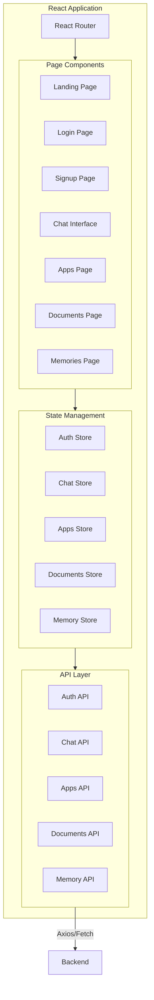
```mermaid
flowchart TB
    subgraph App["React Application"]
        Router[React Router]
        
        subgraph Pages["Page Components"]
            Landing[Landing Page]
            Login[Login Page]
            Signup[Signup Page]
            Chat[Chat Interface]
            Apps[Apps Page]
            Docs[Documents Page]
            Memories[Memories Page]
        end
        
        subgraph State["State Management"]
            AuthStore[Auth Store]
            ChatStore[Chat Store]
            AppsStore[Apps Store]
            DocsStore[Documents Store]
            MemoryStore[Memory Store]
        end
        
        subgraph APILayer["API Layer"]
            AuthAPI[Auth API]
            ChatAPI[Chat API]
            AppsAPI[Apps API]
            DocsAPI[Documents API]
            MemoryAPI[Memory API]
        end
    end
    
    Router --> Pages
    Pages --> State
    State --> APILayer
    APILayer -->|Axios/Fetch| Backend
```

### Backend Architecture

```mermaid
flowchart TB
    subgraph Server["Express Server"]
        Middleware[Middleware Layer]
        
        subgraph Routes["Route Layer"]
            AuthRoutes[/auth]
            ChatRoutes[/chat]
            AppsRoutes[/apps]
            DocsRoutes[/documents]
            MemoryRoutes[/memories]
            VoiceRoutes[/voice]
            AdminRoutes[/admin]
        end
        
        subgraph Controllers["Controller Layer"]
            AuthCtrl[Auth Controller]
            ChatCtrl[Chat Controller]
            AppsCtrl[Apps Controller]
            DocsCtrl[Documents Controller]
            MemoryCtrl[Memory Controller]
            VoiceCtrl[Voice Controller]
        end
        
        subgraph Services["Service Layer"]
            AuthService[Auth Service]
            AgentService[Agent Service]
            OAuthService[OAuth Service]
            DocService[Document Service]
            MemService[Memory Service]
            VoiceService[Voice Service]
        end
    end
    
    Middleware --> Routes
    Routes --> Controllers
    Controllers --> Services
```

---

## Data Flow Diagrams

### Request Flow

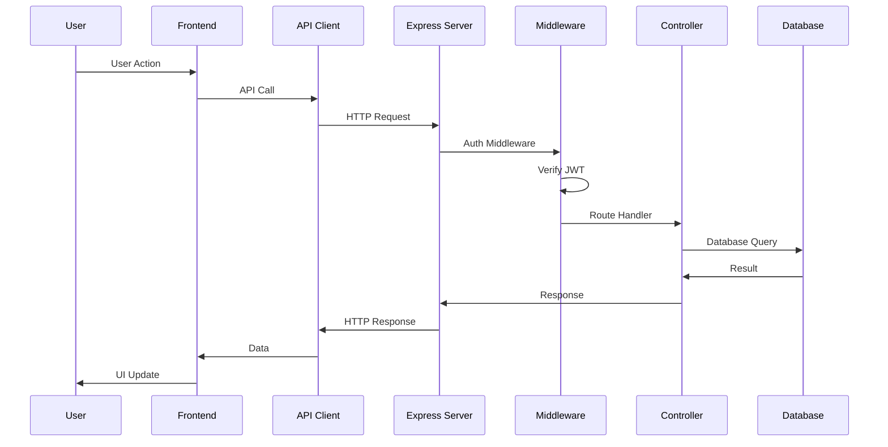
```mermaid
sequenceDiagram
    participant U as User
    participant F as Frontend
    participant A as API Client
    participant S as Express Server
    participant M as Middleware
    participant C as Controller
    participant D as Database

    U->>F: User Action
    F->>A: API Call
    A->>S: HTTP Request
    S->>M: Auth Middleware
    M->>M: Verify JWT
    M->>C: Route Handler
    C->>D: Database Query
    D->>C: Result
    C->>S: Response
    S->>A: HTTP Response
    A->>F: Data
    F->>U: UI Update
```

### Real-time Streaming Flow

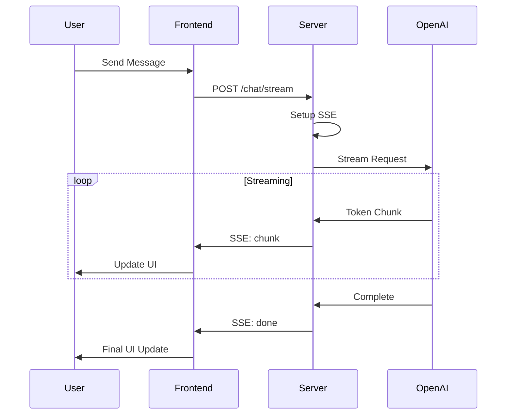
```mermaid
sequenceDiagram
    participant U as User
    participant F as Frontend
    participant S as Server
    participant AI as OpenAI

    U->>F: Send Message
    F->>S: POST /chat/stream
    S->>S: Setup SSE
    S->>AI: Stream Request
    
    loop Streaming
        AI->>S: Token Chunk
        S->>F: SSE: chunk
        F->>U: Update UI
    end
    
    AI->>S: Complete
    S->>F: SSE: done
    F->>U: Final UI Update
```

---

## Authentication Flow

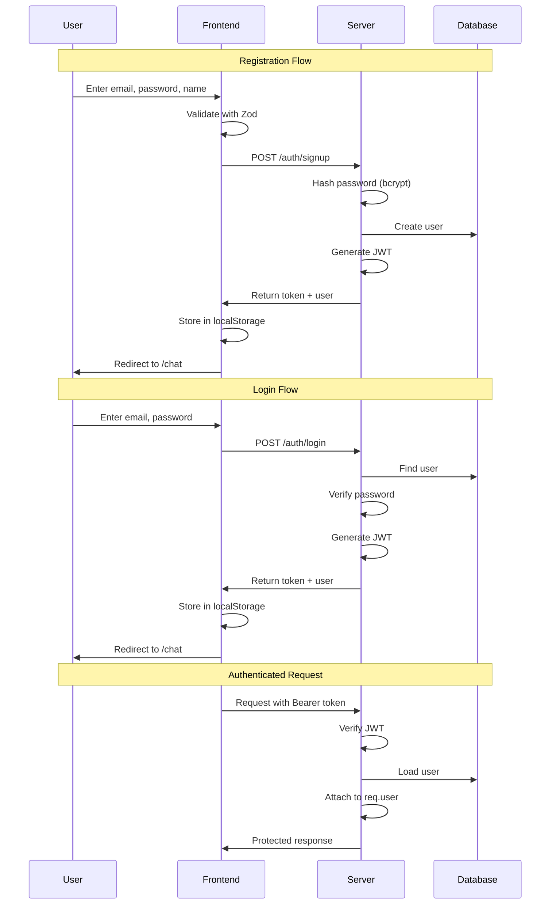
```mermaid
sequenceDiagram
    participant U as User
    participant F as Frontend
    participant S as Server
    participant DB as Database

    Note over U,DB: Registration Flow
    U->>F: Enter email, password, name
    F->>F: Validate with Zod
    F->>S: POST /auth/signup
    S->>S: Hash password (bcrypt)
    S->>DB: Create user
    S->>S: Generate JWT
    S->>F: Return token + user
    F->>F: Store in localStorage
    F->>U: Redirect to /chat

    Note over U,DB: Login Flow
    U->>F: Enter email, password
    F->>S: POST /auth/login
    S->>DB: Find user
    S->>S: Verify password
    S->>S: Generate JWT
    S->>F: Return token + user
    F->>F: Store in localStorage
    F->>U: Redirect to /chat

    Note over U,DB: Authenticated Request
    F->>S: Request with Bearer token
    S->>S: Verify JWT
    S->>DB: Load user
    S->>S: Attach to req.user
    S->>F: Protected response
```

### JWT Token Structure

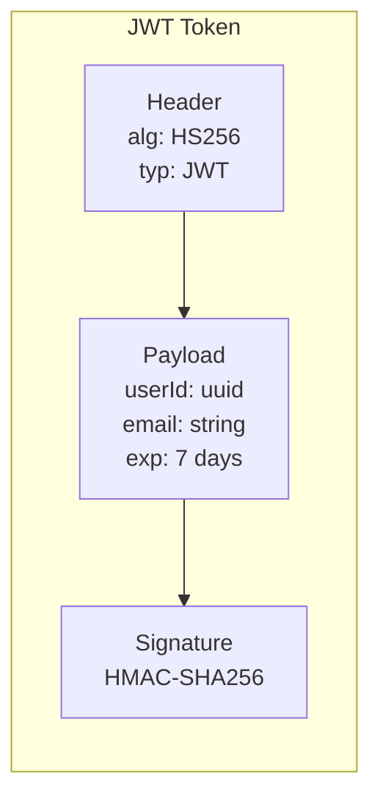
```mermaid
flowchart LR
    subgraph Token["JWT Token"]
        Header["Header<br/>alg: HS256<br/>typ: JWT"]
        Payload["Payload<br/>userId: uuid<br/>email: string<br/>exp: 7 days"]
        Signature["Signature<br/>HMAC-SHA256"]
    end
    
    Header --> Payload --> Signature
```

---

## Chat Message Flow

### Direct Processing (Default)

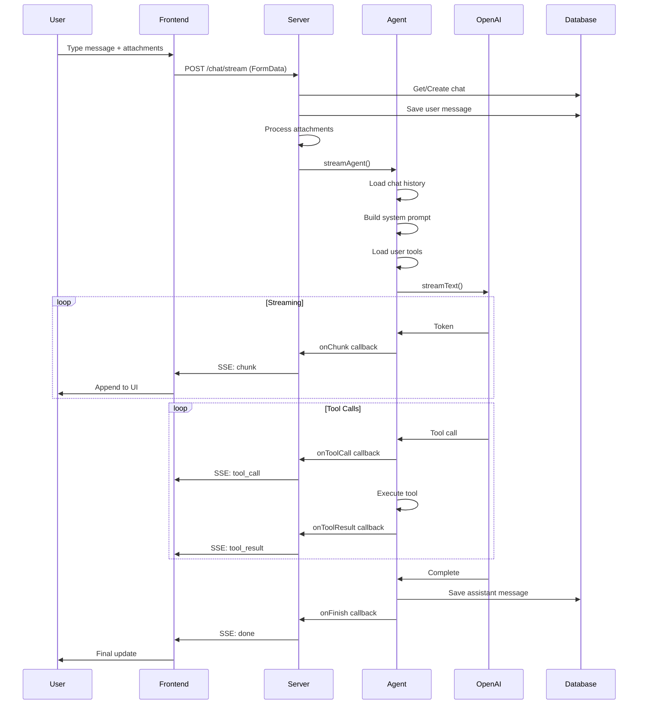
```mermaid
sequenceDiagram
    participant U as User
    participant F as Frontend
    participant S as Server
    participant AG as Agent
    participant AI as OpenAI
    participant DB as Database

    U->>F: Type message + attachments
    F->>S: POST /chat/stream (FormData)
    S->>DB: Get/Create chat
    S->>DB: Save user message
    S->>S: Process attachments
    S->>AG: streamAgent()
    AG->>AG: Load chat history
    AG->>AG: Build system prompt
    AG->>AG: Load user tools
    AG->>AI: streamText()
    
    loop Streaming
        AI->>AG: Token
        AG->>S: onChunk callback
        S->>F: SSE: chunk
        F->>U: Append to UI
    end
    
    loop Tool Calls
        AI->>AG: Tool call
        AG->>S: onToolCall callback
        S->>F: SSE: tool_call
        AG->>AG: Execute tool
        AG->>S: onToolResult callback
        S->>F: SSE: tool_result
    end
    
    AI->>AG: Complete
    AG->>DB: Save assistant message
    AG->>S: onFinish callback
    S->>F: SSE: done
    F->>U: Final update
```

### Redis Queue Processing (Optional)

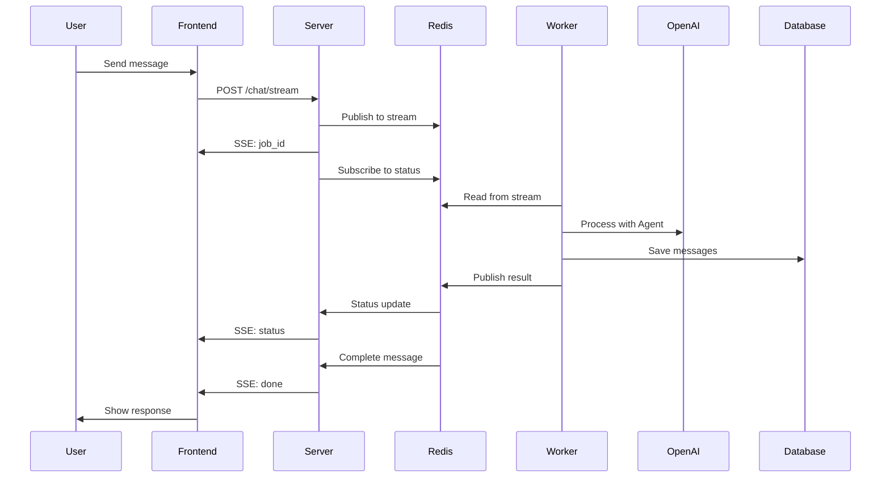
```mermaid
sequenceDiagram
    participant U as User
    participant F as Frontend
    participant S as Server
    participant R as Redis
    participant W as Worker
    participant AI as OpenAI
    participant DB as Database

    U->>F: Send message
    F->>S: POST /chat/stream
    S->>R: Publish to stream
    S->>F: SSE: job_id
    S->>R: Subscribe to status
    
    W->>R: Read from stream
    W->>AI: Process with Agent
    W->>DB: Save messages
    W->>R: Publish result
    
    R->>S: Status update
    S->>F: SSE: status
    R->>S: Complete message
    S->>F: SSE: done
    F->>U: Show response
```

---

## AI Agent Architecture

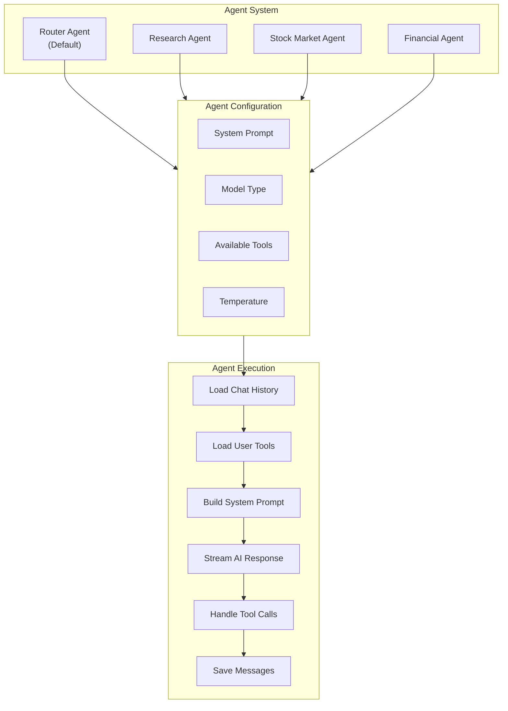
```mermaid
flowchart TB
    subgraph Agents["Agent System"]
        Router["Router Agent<br/>(Default)"]
        Research["Research Agent"]
        StockMarket["Stock Market Agent"]
        Financial["Financial Agent"]
    end
    
    subgraph Config["Agent Configuration"]
        SystemPrompt[System Prompt]
        ModelType[Model Type]
        Tools[Available Tools]
        Temperature[Temperature]
    end
    
    subgraph Execution["Agent Execution"]
        LoadHistory[Load Chat History]
        LoadTools[Load User Tools]
        BuildPrompt[Build System Prompt]
        StreamAI[Stream AI Response]
        HandleTools[Handle Tool Calls]
        SaveMessage[Save Messages]
    end
    
    Router --> Config
    Research --> Config
    StockMarket --> Config
    Financial --> Config
    
    Config --> LoadHistory
    LoadHistory --> LoadTools
    LoadTools --> BuildPrompt
    BuildPrompt --> StreamAI
    StreamAI --> HandleTools
    HandleTools --> SaveMessage
```

### Hybrid Memory System

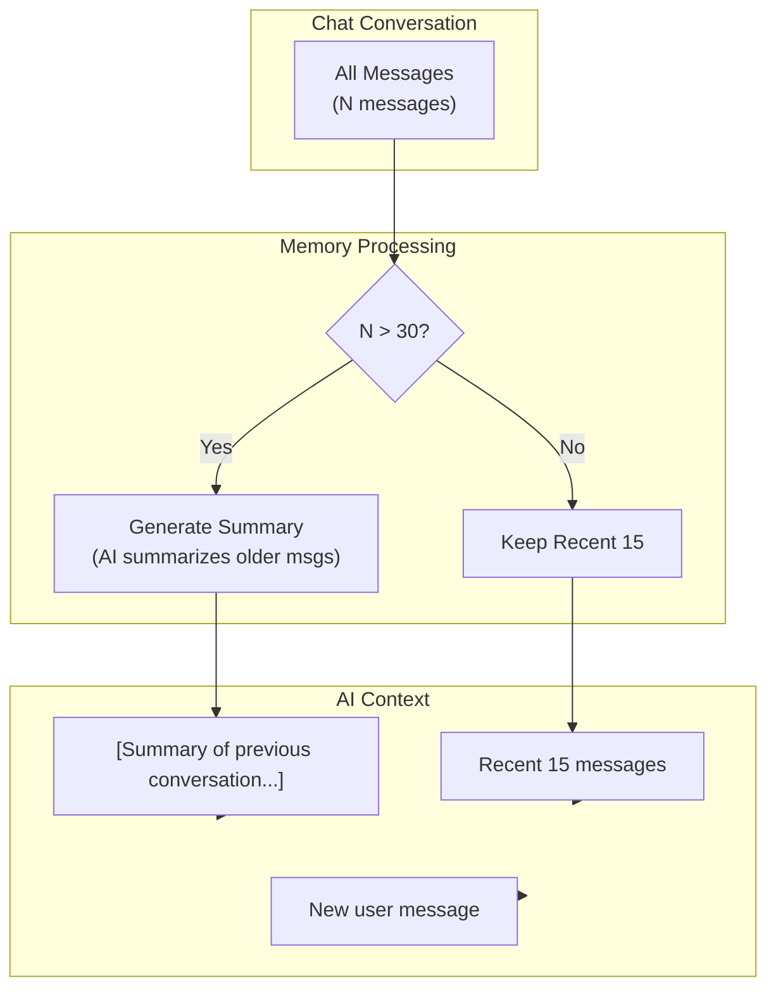
```mermaid
flowchart TB
    subgraph Chat["Chat Conversation"]
        AllMessages["All Messages<br/>(N messages)"]
    end
    
    subgraph Processing["Memory Processing"]
        Check{N > 30?}
        Summary["Generate Summary<br/>(AI summarizes older msgs)"]
        Recent["Keep Recent 15"]
    end
    
    subgraph Context["AI Context"]
        SummaryContext["[Summary of previous conversation...]"]
        RecentMessages["Recent 15 messages"]
        NewMessage["New user message"]
    end
    
    AllMessages --> Check
    Check -->|Yes| Summary
    Check -->|No| Recent
    Summary --> SummaryContext
    Recent --> RecentMessages
    SummaryContext --> Context
    RecentMessages --> Context
    NewMessage --> Context
```

---

## Tool Execution Flow

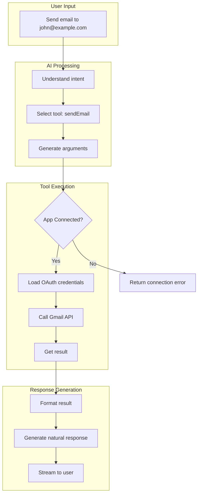
```mermaid
flowchart TB
    subgraph Input["User Input"]
        Message["Send email to john@example.com"]
    end
    
    subgraph AI["AI Processing"]
        Understand["Understand intent"]
        SelectTool["Select tool: sendEmail"]
        GenerateArgs["Generate arguments"]
    end
    
    subgraph Execution["Tool Execution"]
        CheckAuth{App Connected?}
        LoadCreds["Load OAuth credentials"]
        CallAPI["Call Gmail API"]
        GetResult["Get result"]
    end
    
    subgraph Response["Response Generation"]
        FormatResult["Format result"]
        GenerateText["Generate natural response"]
        Stream["Stream to user"]
    end
    
    Message --> Understand
    Understand --> SelectTool
    SelectTool --> GenerateArgs
    GenerateArgs --> CheckAuth
    CheckAuth -->|Yes| LoadCreds
    CheckAuth -->|No| Error["Return connection error"]
    LoadCreds --> CallAPI
    CallAPI --> GetResult
    GetResult --> FormatResult
    FormatResult --> GenerateText
    GenerateText --> Stream
```

### Tool Categories

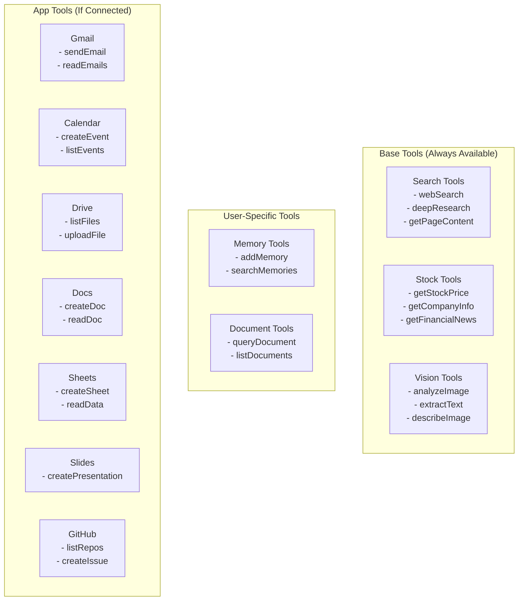
```mermaid
flowchart TB
    subgraph BaseTools["Base Tools (Always Available)"]
        Search["Search Tools<br/>- webSearch<br/>- deepResearch<br/>- getPageContent"]
        Stock["Stock Tools<br/>- getStockPrice<br/>- getCompanyInfo<br/>- getFinancialNews"]
        Vision["Vision Tools<br/>- analyzeImage<br/>- extractText<br/>- describeImage"]
    end
    
    subgraph UserTools["User-Specific Tools"]
        Memory["Memory Tools<br/>- addMemory<br/>- searchMemories"]
        Document["Document Tools<br/>- queryDocument<br/>- listDocuments"]
    end
    
    subgraph AppTools["App Tools (If Connected)"]
        Gmail["Gmail<br/>- sendEmail<br/>- readEmails"]
        Calendar["Calendar<br/>- createEvent<br/>- listEvents"]
        Drive["Drive<br/>- listFiles<br/>- uploadFile"]
        Docs["Docs<br/>- createDoc<br/>- readDoc"]
        Sheets["Sheets<br/>- createSheet<br/>- readData"]
        Slides["Slides<br/>- createPresentation"]
        GitHub["GitHub<br/>- listRepos<br/>- createIssue"]
    end
```

---

## OAuth Integration Flow

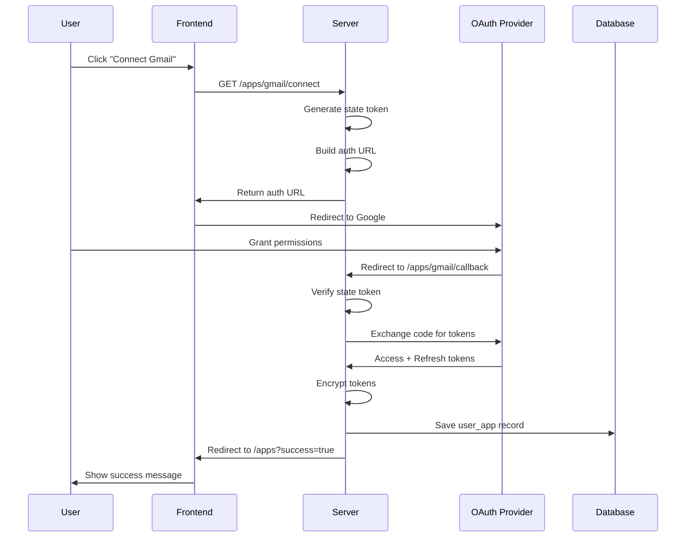
```mermaid
sequenceDiagram
    participant U as User
    participant F as Frontend
    participant S as Server
    participant P as OAuth Provider
    participant DB as Database

    U->>F: Click "Connect Gmail"
    F->>S: GET /apps/gmail/connect
    S->>S: Generate state token
    S->>S: Build auth URL
    S->>F: Return auth URL
    F->>P: Redirect to Google
    U->>P: Grant permissions
    P->>S: Redirect to /apps/gmail/callback
    S->>S: Verify state token
    S->>P: Exchange code for tokens
    P->>S: Access + Refresh tokens
    S->>S: Encrypt tokens
    S->>DB: Save user_app record
    S->>F: Redirect to /apps?success=true
    F->>U: Show success message
```

### OAuth State Management

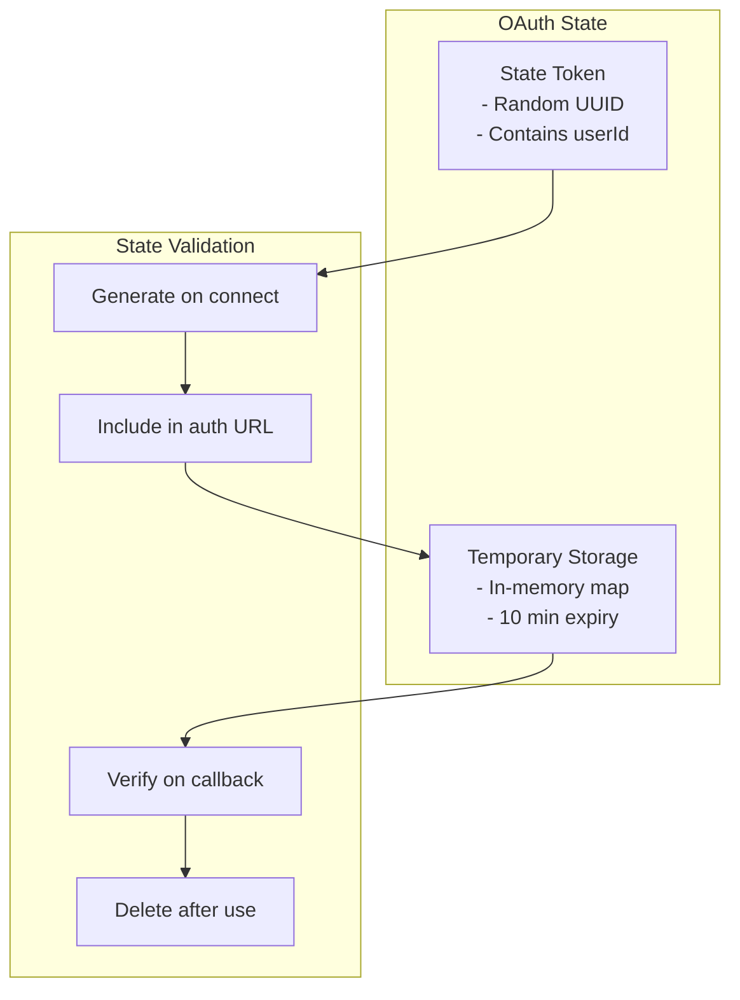
```mermaid
flowchart TB
    subgraph State["OAuth State"]
        Token["State Token<br/>- Random UUID<br/>- Contains userId"]
        Storage["Temporary Storage<br/>- In-memory map<br/>- 10 min expiry"]
    end
    
    subgraph Validation["State Validation"]
        Generate["Generate on connect"]
        Include["Include in auth URL"]
        Verify["Verify on callback"]
        Cleanup["Delete after use"]
    end
    
    Token --> Generate
    Generate --> Include
    Include --> Storage
    Storage --> Verify
    Verify --> Cleanup
```

---

## Document Processing (RAG) Flow

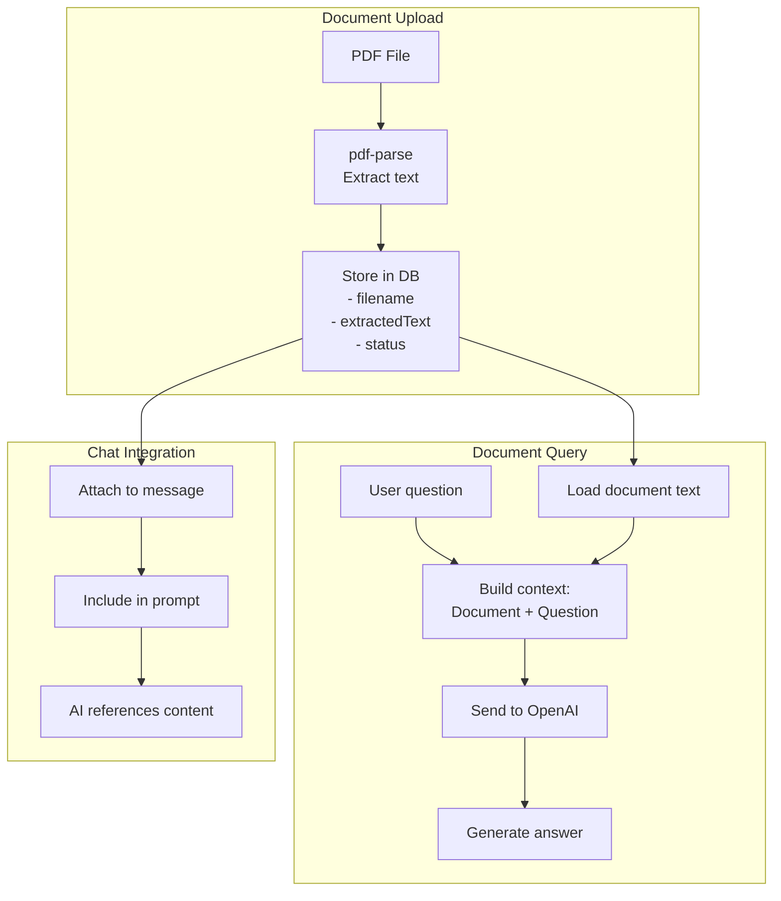
```mermaid
flowchart TB
    subgraph Upload["Document Upload"]
        File["PDF File"]
        Parse["pdf-parse<br/>Extract text"]
        Store["Store in DB<br/>- filename<br/>- extractedText<br/>- status"]
    end
    
    subgraph Query["Document Query"]
        Question["User question"]
        LoadDoc["Load document text"]
        BuildContext["Build context:<br/>Document + Question"]
        SendAI["Send to OpenAI"]
        Answer["Generate answer"]
    end
    
    subgraph Chat["Chat Integration"]
        Attach["Attach to message"]
        Include["Include in prompt"]
        Reference["AI references content"]
    end
    
    File --> Parse
    Parse --> Store
    Store --> LoadDoc
    Question --> BuildContext
    LoadDoc --> BuildContext
    BuildContext --> SendAI
    SendAI --> Answer
    
    Store --> Attach
    Attach --> Include
    Include --> Reference
```

### Document Context Building

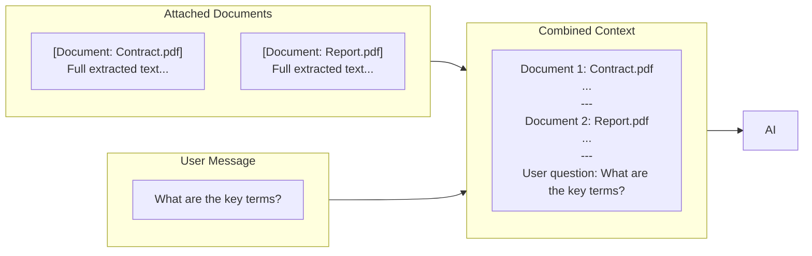
```mermaid
flowchart LR
    subgraph Documents["Attached Documents"]
        Doc1["[Document: Contract.pdf]<br/>Full extracted text..."]
        Doc2["[Document: Report.pdf]<br/>Full extracted text..."]
    end
    
    subgraph Message["User Message"]
        Question["What are the key terms?"]
    end
    
    subgraph Combined["Combined Context"]
        Context["Document 1: Contract.pdf<br/>...<br/>---<br/>Document 2: Report.pdf<br/>...<br/>---<br/>User question: What are the key terms?"]
    end
    
    Documents --> Combined
    Message --> Combined
    Combined --> AI
```

---

## Memory System Architecture

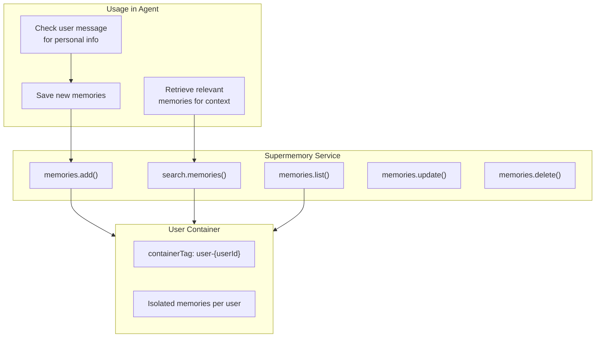
```mermaid
flowchart TB
    subgraph Supermemory["Supermemory Service"]
        Add["memories.add()"]
        Search["search.memories()"]
        List["memories.list()"]
        Update["memories.update()"]
        Delete["memories.delete()"]
    end
    
    subgraph Container["User Container"]
        Tag["containerTag: user-{userId}"]
        Isolation["Isolated memories per user"]
    end
    
    subgraph Usage["Usage in Agent"]
        Check["Check user message<br/>for personal info"]
        Save["Save new memories"]
        Retrieve["Retrieve relevant<br/>memories for context"]
    end
    
    Add --> Container
    Search --> Container
    List --> Container
    
    Check --> Save
    Save --> Add
    Retrieve --> Search
```

### Memory Context Flow

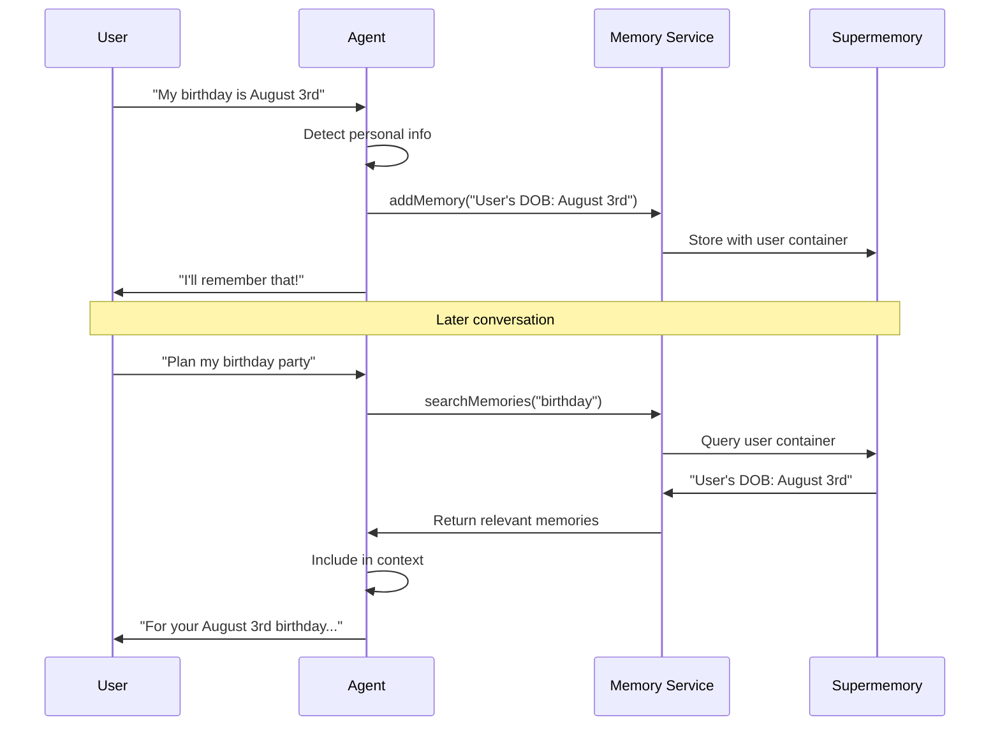
```mermaid
sequenceDiagram
    participant U as User
    participant A as Agent
    participant M as Memory Service
    participant S as Supermemory

    U->>A: "My birthday is August 3rd"
    A->>A: Detect personal info
    A->>M: addMemory("User's DOB: August 3rd")
    M->>S: Store with user container
    A->>U: "I'll remember that!"

    Note over U,S: Later conversation

    U->>A: "Plan my birthday party"
    A->>M: searchMemories("birthday")
    M->>S: Query user container
    S->>M: "User's DOB: August 3rd"
    M->>A: Return relevant memories
    A->>A: Include in context
    A->>U: "For your August 3rd birthday..."
```

---

## Voice Processing Flow

### Speech-to-Text + AI + Text-to-Speech

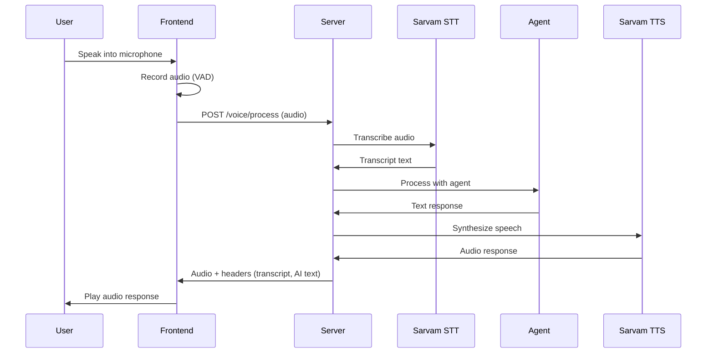
```mermaid
sequenceDiagram
    participant U as User
    participant F as Frontend
    participant S as Server
    participant STT as Sarvam STT
    participant AI as Agent
    participant TTS as Sarvam TTS

    U->>F: Speak into microphone
    F->>F: Record audio (VAD)
    F->>S: POST /voice/process (audio)
    S->>STT: Transcribe audio
    STT->>S: Transcript text
    S->>AI: Process with agent
    AI->>S: Text response
    S->>TTS: Synthesize speech
    TTS->>S: Audio response
    S->>F: Audio + headers (transcript, AI text)
    F->>U: Play audio response
```

### Live Voice Chat (LiveKit)

```mermaid
flowchart TB
    subgraph Client["Frontend"]
        VAD["Voice Activity Detection"]
        Audio["Audio Capture"]
        LiveKit["LiveKit Client"]
    end
    
    subgraph Server["Backend"]
        TokenGen["Token Generator"]
        Webhook["Webhook Handler"]
    end
    
    subgraph LiveKitCloud["LiveKit Cloud"]
        Room["Voice Room"]
        Processing["Audio Processing"]
    end
    
    Audio --> VAD
    VAD --> LiveKit
    LiveKit --> Room
    TokenGen --> LiveKit
    Room --> Processing
    Processing --> AI
    AI --> TTS
    TTS --> Room
    Room --> Client
```

---

## Redis Queue Architecture

```mermaid
flowchart TB
    subgraph Producer["API Server (Producer)"]
        Receive["Receive message"]
        Publish["Publish to stream"]
        Subscribe["Subscribe to results"]
        Stream["SSE to client"]
    end
    
    subgraph Redis["Redis"]
        MessageStream["message_stream<br/>(Consumer Group)"]
        DLQ["dlq_stream<br/>(Dead Letter Queue)"]
        PubSub["Pub/Sub Channels"]
    end
    
    subgraph Worker["Worker Process"]
        Consume["Consume from stream"]
        Process["Process with Agent"]
        Ack["Acknowledge message"]
        PublishResult["Publish result"]
    end
    
    subgraph ErrorHandling["Error Handling"]
        Retry["Retry logic"]
        MaxRetries{Max retries?}
        MoveDLQ["Move to DLQ"]
    end
    
    Receive --> Publish
    Publish --> MessageStream
    MessageStream --> Consume
    Consume --> Process
    Process --> Ack
    Ack --> PublishResult
    PublishResult --> PubSub
    PubSub --> Subscribe
    Subscribe --> Stream
    
    Process -->|Error| Retry
    Retry --> MaxRetries
    MaxRetries -->|Yes| MoveDLQ
    MaxRetries -->|No| MessageStream
    MoveDLQ --> DLQ
```

### Job States

```mermaid
stateDiagram-v2
    [*] --> PENDING: Message received
    PENDING --> PROCESSING: Worker picks up
    PROCESSING --> COMPLETED: Success
    PROCESSING --> FAILED: Error
    FAILED --> PROCESSING: Retry
    FAILED --> DEAD: Max retries exceeded
    COMPLETED --> [*]
    DEAD --> [*]
```

---

## Database Schema Diagram

```mermaid
erDiagram
    users ||--o{ chats : "has many"
    users ||--o{ documents : "has many"
    users ||--o{ user_apps : "has many"
    users ||--o{ user_tools : "has many"
    
    chats ||--o{ messages : "has many"
    chats ||--o{ documents : "may have"
    
    apps ||--o{ user_apps : "connected by"
    
    users {
        uuid id PK
        string email UK
        string name
        string password
        datetime createdAt
        datetime updatedAt
    }
    
    chats {
        uuid id PK
        uuid userId FK
        string title
        string agentType
        string threadId UK
        text summary
        int summarizedUpTo
        datetime createdAt
        datetime updatedAt
    }
    
    messages {
        uuid id PK
        uuid chatId FK
        string role
        text content
        json toolCalls
        json imageAttachments
        json documentAttachments
        datetime createdAt
    }
    
    apps {
        uuid id PK
        string name UK
        string category
        string displayName
        string description
        string icon
        string authType
        boolean isActive
        json config
    }
    
    user_apps {
        uuid id PK
        uuid userId FK
        uuid appId FK
        json credentials
        json metadata
        boolean isConnected
        datetime lastSyncAt
    }
    
    documents {
        uuid id PK
        uuid userId FK
        uuid chatId FK
        string filename
        string displayName
        string mimeType
        int fileSize
        int pageCount
        text extractedText
        string status
        text summary
    }
    
    message_jobs {
        uuid id PK
        string jobId UK
        uuid chatId
        uuid userId
        string status
        text message
        string agentType
        json result
        string error
        int retryCount
    }
    
    agents {
        uuid id PK
        string name UK
        string displayName
        string description
        text systemPrompt
        boolean isActive
    }
    
    tools {
        uuid id PK
        string name UK
        string category
        string displayName
        string description
        boolean requiresAuth
        boolean isActive
    }
    
    user_tools {
        uuid id PK
        uuid userId FK
        string toolCategory
        json credentials
        boolean isConnected
    }
```

---

## Docker Architecture

### Docker Compose Stack

```mermaid
flowchart TB
    subgraph DockerCompose["Docker Compose Stack"]
        subgraph Containers["Application Containers"]
            Frontend["kuma-frontend<br/>NGINX:80"]
            Backend["kuma-backend<br/>Bun:3001"]
            Worker["kuma-worker<br/>(optional)"]
        end
        
        subgraph DataContainers["Data Containers"]
            Postgres["kuma-postgres<br/>PostgreSQL:5432"]
            Redis["kuma-redis<br/>Redis:6379"]
        end
        
        subgraph Volumes["Persistent Volumes"]
            PGData["postgres_data"]
            RedisData["redis_data"]
            Uploads["backend_uploads"]
        end
    end
    
    Frontend -->|HTTP| Backend
    Backend --> Postgres
    Backend --> Redis
    Worker --> Redis
    Worker --> Postgres
    
    Postgres --> PGData
    Redis --> RedisData
    Backend --> Uploads
```

### Multi-Stage Build Process

```mermaid
flowchart LR
    subgraph BackendBuild["Backend Dockerfile"]
        BD1["Stage 1: deps<br/>Install dependencies"]
        BD2["Stage 2: builder<br/>Generate Prisma"]
        BD3["Stage 3: production<br/>Final image"]
    end
    
    subgraph FrontendBuild["Frontend Dockerfile"]
        FD1["Stage 1: deps<br/>Install dependencies"]
        FD2["Stage 2: builder<br/>Vite build"]
        FD3["Stage 3: production<br/>NGINX serve"]
    end
    
    BD1 --> BD2 --> BD3
    FD1 --> FD2 --> FD3
```

### Docker Container Communication

```mermaid
flowchart TB
    subgraph Network["kuma-network (bridge)"]
        Frontend["Frontend<br/>:80"]
        Backend["Backend<br/>:3001"]
        Worker["Worker"]
        Postgres["Postgres<br/>:5432"]
        Redis["Redis<br/>:6379"]
    end
    
    subgraph Exposed["Exposed Ports"]
        Port80["Host :80"]
        Port3001["Host :3001"]
        Port5432["Host :5432"]
        Port6379["Host :6379"]
    end
    
    Port80 --> Frontend
    Port3001 --> Backend
    Port5432 --> Postgres
    Port6379 --> Redis
    
    Frontend -.->|internal| Backend
    Backend -.->|internal| Postgres
    Backend -.->|internal| Redis
    Worker -.->|internal| Postgres
    Worker -.->|internal| Redis
```

### Docker Image Layers

```mermaid
flowchart TB
    subgraph BackendImage["Backend Image"]
        BL1["bun:1.1-alpine"]
        BL2["node_modules"]
        BL3["Prisma client"]
        BL4["Application code"]
        BL5["Non-root user"]
    end
    
    subgraph FrontendImage["Frontend Image"]
        FL1["nginx:alpine"]
        FL2["Custom nginx.conf"]
        FL3["Built static files"]
        FL4["Public assets"]
    end
    
    BL1 --> BL2 --> BL3 --> BL4 --> BL5
    FL1 --> FL2 --> FL3 --> FL4
```

### Health Check Flow

```mermaid
sequenceDiagram
    participant D as Docker Daemon
    participant C as Container
    participant H as Health Endpoint

    loop Every 30 seconds
        D->>C: Execute HEALTHCHECK
        C->>H: wget /api/health or /health
        alt Healthy
            H->>C: 200 OK
            C->>D: Exit 0 (healthy)
        else Unhealthy
            H->>C: Error/Timeout
            C->>D: Exit 1 (unhealthy)
        end
    end
    
    Note over D: After 3 failures,<br/>container marked unhealthy
```

### Docker Deployment Commands

```mermaid
flowchart LR
    subgraph Development["Development"]
        DevUp["docker-compose -f docker-compose.dev.yml up"]
        DevDown["docker-compose -f docker-compose.dev.yml down"]
    end
    
    subgraph Production["Production"]
        ProdUp["docker-compose up -d"]
        ProdWorker["docker-compose --profile with-worker up -d"]
        ProdDown["docker-compose down"]
    end
    
    subgraph Maintenance["Maintenance"]
        Logs["docker-compose logs -f"]
        Rebuild["docker-compose up -d --build"]
        Prune["docker system prune"]
    end
```

---

## Deployment Architecture

### Development Setup

```mermaid
flowchart TB
    subgraph Local["Local Development"]
        Frontend["Frontend<br/>localhost:5173"]
        Backend["Backend<br/>localhost:3001"]
        Worker["Worker<br/>(optional)"]
        Postgres["PostgreSQL<br/>localhost:5432"]
        Redis["Redis<br/>localhost:6379<br/>(optional)"]
    end
    
    Frontend -->|HTTP| Backend
    Backend --> Postgres
    Backend --> Redis
    Worker --> Redis
    Worker --> Postgres
```

### Docker Development Setup

```mermaid
flowchart TB
    subgraph DockerDev["Docker Development (docker-compose.dev.yml)"]
        FrontendDev["Frontend Dev<br/>:5173 (Vite HMR)"]
        BackendDev["Backend Dev<br/>:3001 (Hot Reload)"]
        PostgresDev["Postgres<br/>:5432"]
        RedisDev["Redis<br/>:6379"]
        PrismaStudio["Prisma Studio<br/>:5555"]
    end
    
    subgraph HostMounts["Host Volume Mounts"]
        SrcFE["./frontend/src"]
        SrcBE["./backend/src"]
    end
    
    SrcFE -.->|mounted| FrontendDev
    SrcBE -.->|mounted| BackendDev
    
    FrontendDev --> BackendDev
    BackendDev --> PostgresDev
    BackendDev --> RedisDev
    PrismaStudio --> PostgresDev
```

### Production Docker Setup

```mermaid
flowchart TB
    subgraph DockerProd["Docker Production (docker-compose.yml)"]
        FrontendProd["Frontend<br/>NGINX :80"]
        BackendProd["Backend API<br/>:3001"]
        WorkerProd["Worker<br/>(--profile with-worker)"]
        PostgresProd["Postgres<br/>:5432"]
        RedisProd["Redis<br/>:6379"]
    end
    
    subgraph PersistentData["Persistent Volumes"]
        PGVol["postgres_data"]
        RedisVol["redis_data"]
        UploadsVol["backend_uploads"]
    end
    
    FrontendProd --> BackendProd
    BackendProd --> PostgresProd
    BackendProd --> RedisProd
    WorkerProd --> PostgresProd
    WorkerProd --> RedisProd
    
    PostgresProd --> PGVol
    RedisProd --> RedisVol
    BackendProd --> UploadsVol
```

### Production Setup (Cloud)

```mermaid
flowchart TB
    subgraph CDN["CDN/Static Hosting"]
        StaticFiles["Static React Build"]
    end
    
    subgraph LoadBalancer["Load Balancer"]
        LB["NGINX / Cloud LB"]
    end
    
    subgraph AppServers["Application Servers"]
        Server1["API Server 1"]
        Server2["API Server 2"]
        ServerN["API Server N"]
    end
    
    subgraph Workers["Worker Processes"]
        Worker1["Worker 1"]
        Worker2["Worker 2"]
    end
    
    subgraph Data["Data Layer"]
        Postgres[(PostgreSQL<br/>Primary + Replica)]
        Redis[(Redis Cluster)]
    end
    
    subgraph External["External Services"]
        OpenAI[OpenAI API]
        Google[Google APIs]
        Supermemory[Supermemory]
    end
    
    CDN --> LB
    LB --> AppServers
    AppServers --> Postgres
    AppServers --> Redis
    Workers --> Redis
    Workers --> Postgres
    AppServers --> External
    Workers --> External
```

---

## Security Architecture

### Authentication & Authorization

```mermaid
flowchart TB
    subgraph Client["Client Side"]
        Token["JWT in localStorage"]
        Header["Authorization header"]
    end
    
    subgraph Server["Server Side"]
        Middleware["Auth Middleware"]
        Verify["JWT Verification"]
        UserLoad["Load User from DB"]
        Attach["Attach to req.user"]
    end
    
    subgraph Protection["Protected Resources"]
        Routes["Protected Routes"]
        UserData["User-specific data"]
    end
    
    Token --> Header
    Header --> Middleware
    Middleware --> Verify
    Verify -->|Valid| UserLoad
    Verify -->|Invalid| Reject["401 Unauthorized"]
    UserLoad --> Attach
    Attach --> Routes
    Routes --> UserData
```

### Data Security

```mermaid
flowchart TB
    subgraph Passwords["Password Security"]
        Plain["Plain password"]
        Bcrypt["bcrypt hash<br/>(10 rounds)"]
        Store["Store hashed"]
    end
    
    subgraph OAuth["OAuth Credentials"]
        Tokens["OAuth Tokens"]
        Encrypt["AES Encryption"]
        EncryptedStore["Store encrypted"]
    end
    
    subgraph Transit["Data in Transit"]
        HTTPS["HTTPS/TLS"]
        Bearer["Bearer Token Auth"]
    end
    
    subgraph Isolation["Data Isolation"]
        UserID["User ID Filter"]
        Ownership["Ownership Checks"]
    end
    
    Plain --> Bcrypt --> Store
    Tokens --> Encrypt --> EncryptedStore
```

### Security Measures Summary

| Layer | Measure |
|-------|---------|
| Transport | HTTPS/TLS encryption |
| Authentication | JWT with expiration |
| Passwords | bcrypt hashing (10 rounds) |
| OAuth Tokens | AES encryption at rest |
| Data Access | User ID filtering on all queries |
| Rate Limiting | Express middleware (configurable) |
| CORS | Configured for frontend origin |
| Input Validation | Zod schemas on all inputs |

---

## Performance Considerations

### Caching Strategy

```mermaid
flowchart TB
    subgraph Request["Incoming Request"]
        Check{In Cache?}
    end
    
    subgraph Cache["Caching Layers"]
        Memory["In-Memory<br/>(OAuth clients)"]
        Redis["Redis<br/>(Session data)"]
    end
    
    subgraph Database["Database"]
        Postgres["PostgreSQL"]
    end
    
    Check -->|Yes| Memory
    Check -->|No| Database
    Database --> Memory
    Memory --> Response
```

### Optimization Techniques

1. **Chat History**: Hybrid memory with summarization
2. **Streaming**: SSE for real-time updates
3. **Connection Pooling**: Prisma connection pool
4. **File Cleanup**: Hourly temp file cleanup
5. **Lazy Loading**: Tools loaded per request

---

## Scaling Considerations

### Horizontal Scaling

```mermaid
flowchart LR
    subgraph Stateless["Stateless Components"]
        API1["API Server 1"]
        API2["API Server 2"]
        Worker1["Worker 1"]
        Worker2["Worker 2"]
    end
    
    subgraph Stateful["Stateful Components"]
        DB[(Database)]
        Redis[(Redis)]
    end
    
    LB --> API1
    LB --> API2
    API1 --> DB
    API2 --> DB
    API1 --> Redis
    API2 --> Redis
    Worker1 --> Redis
    Worker2 --> Redis
```

### Scaling Strategies

| Component | Strategy |
|-----------|----------|
| API Servers | Horizontal scaling behind load balancer |
| Workers | Scale based on queue depth |
| Database | Read replicas, connection pooling |
| Redis | Redis Cluster for high availability |
| File Storage | Move to S3/Cloud Storage |

---

## Docker Deployment Guide

### File Structure

```bash
Kuma/
├── docker-compose.yml        # Production stack
├── docker-compose.dev.yml    # Development stack
├── .env.example              # Environment template
├── .dockerignore             # Docker ignore patterns
├── backend/
│   ├── Dockerfile            # Backend API image
│   └── Dockerfile.worker     # Worker image
└── frontend/
    ├── Dockerfile            # Frontend image
    └── nginx.conf            # NGINX configuration
```

### Quick Start

```mermaid
flowchart LR
    A["1. Clone repo"] --> B["2. Copy .env"]
    B --> C["3. Fill secrets"]
    C --> D["4. docker-compose up"]
    D --> E["5. Access app"]
```

### Step-by-Step Deployment

#### 1. Prerequisites

```bash
# Required
- Docker 20.10+
- Docker Compose 2.0+
- 4GB RAM minimum
- 20GB disk space
```

#### 2. Configure Environment

```bash
# Copy environment template
cp .env.example .env

# Edit with your values
nano .env
```

#### 3. Start the Stack

```bash
# Development mode (with hot reload)
docker-compose -f docker-compose.dev.yml up -d

# Production mode
docker-compose up -d

# Production with Redis worker
docker-compose --profile with-worker up -d
```

#### 4. Initialize Database

```bash
# Run migrations
docker-compose exec backend bunx prisma migrate deploy

# Seed data (optional)
docker-compose exec backend bun run db:seed
```

#### 5. Access the Application

| Service | URL |
|---------|-----|
| Frontend | <http://localhost> |
| Backend API | <http://localhost:3001/api> |
| Prisma Studio | <http://localhost:5555> (dev) |

### Docker Commands Reference

```mermaid
flowchart TB
    subgraph Build["Build Commands"]
        B1["docker-compose build"]
        B2["docker-compose build --no-cache"]
        B3["docker-compose build backend"]
    end
    
    subgraph Run["Run Commands"]
        R1["docker-compose up -d"]
        R2["docker-compose up -d --build"]
        R3["docker-compose --profile with-worker up -d"]
    end
    
    subgraph Monitor["Monitor Commands"]
        M1["docker-compose ps"]
        M2["docker-compose logs -f"]
        M3["docker-compose logs backend"]
    end
    
    subgraph Manage["Management Commands"]
        MG1["docker-compose stop"]
        MG2["docker-compose down"]
        MG3["docker-compose down -v"]
    end
```

### Environment Variables

```mermaid
flowchart TB
    subgraph Required["Required Variables"]
        JWT["JWT_SECRET"]
        OpenAI["OPENAI_API_KEY"]
        PG["POSTGRES_PASSWORD"]
    end
    
    subgraph OAuth["OAuth (Optional)"]
        Google["GOOGLE_CLIENT_ID<br/>GOOGLE_CLIENT_SECRET"]
        GitHub["GITHUB_CLIENT_ID<br/>GITHUB_CLIENT_SECRET"]
    end
    
    subgraph Services["External Services"]
        Super["SUPERMEMORY_API_KEY"]
        Exa["EXA_API_KEY"]
        Sarvam["SARVAM_API_KEY"]
        LiveKit["LIVEKIT_API_KEY"]
    end
```

### Production Checklist

| Task | Command/Action |
|------|----------------|
| Set strong passwords | Edit .env |
| Enable HTTPS | Configure reverse proxy |
| Set FRONTEND_URL | For OAuth callbacks |
| Enable Redis queue | USE_REDIS_QUEUE=true |
| Setup backups | pg_dump schedule |
| Configure logging | Docker logging driver |
| Set resource limits | Docker Compose limits |

### Troubleshooting

```mermaid
flowchart TB
    Problem["Problem"]
    
    Problem --> Check1{Container running?}
    Check1 -->|No| Fix1["docker-compose up -d"]
    Check1 -->|Yes| Check2{Healthy?}
    
    Check2 -->|No| Fix2["Check logs:<br/>docker-compose logs service"]
    Check2 -->|Yes| Check3{Network issue?}
    
    Check3 -->|Yes| Fix3["docker network inspect kuma-network"]
    Check3 -->|No| Check4{DB connected?}
    
    Check4 -->|No| Fix4["Check DATABASE_URL<br/>and postgres container"]
    Check4 -->|Yes| Fix5["Check application logs"]
```

### Common Issues

| Issue | Solution |
|-------|----------|
| Port already in use | Change port mapping in docker-compose.yml |
| Database connection refused | Wait for postgres health check |
| Frontend can't reach backend | Check VITE_API_URL |
| OAuth redirect fails | Set correct FRONTEND_URL |
| Container OOM | Increase Docker memory limit |

### Backup and Restore

```bash
# Backup database
docker-compose exec postgres pg_dump -U kuma kuma_db > backup.sql

# Restore database
cat backup.sql | docker-compose exec -T postgres psql -U kuma kuma_db

# Backup volumes
docker run --rm -v kuma_postgres_data:/data -v $(pwd):/backup alpine tar cvf /backup/postgres_backup.tar /data
```

### Updating the Stack

```bash
# Pull latest code
git pull

# Rebuild and restart
docker-compose down
docker-compose build --no-cache
docker-compose up -d

# Run any new migrations
docker-compose exec backend bunx prisma migrate deploy
```

---

This architecture documentation provides a comprehensive view of the Kuma AI system. For implementation details, refer to the specific code files in the codebase.
[EOF]